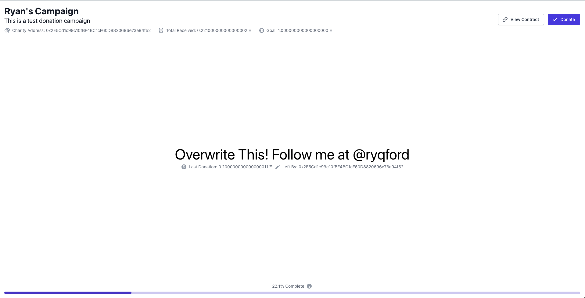

# Donation Campaign with Auction

Got the idea from a reddit comment as ideas for dApps for beginners, decided to try it to learn how to make dApps.

Deployed on the rinkeby test network [here](https://charity-auction.vercel.app/)

- Smart contract has a string field which serves as the comment from the last contributor
- To change the string, you must donate more than the last string-changer
- At the end of every month (using an oracle) or more easily: after reaching a certain threshold, the tokens will be donated to a chosen charity (see [charities-accepting-ether](https://github.com/porobov/charities-accepting-ether))

